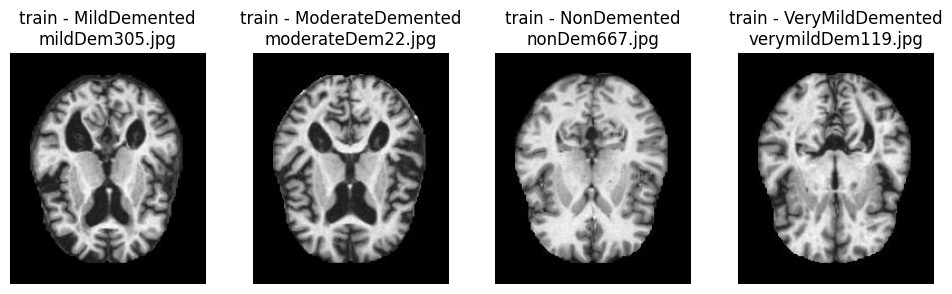

# **Severity Classification of Alzheimer's Disease Using MRI Images**
### Peacock Data Science Co.
### Jason Lu, Juan Marcucci, Dan Rossetti

>For this project we are Peacock Data Science Co., and we have been contracted by the Alzheimer's Foundation to create a cutting edge diagnostic tool which performs severity classification of Alzheimer's Disease in MRI images of brains.

### Table of contents:
- [Problem Statement](#Problem-Statement)
- [Succinct Formulation of the Question](#Succinct-formulation-of-the-question)
- [Data Acquisition](#Data-Acquisition)
- [Software Requirements](#Software-Requirements)
- [Notebooks](#Notebooks)
- [Modeling](#Modeling)
- [Summary](#Summary)
- [Conclusion](#Conclusion)
- [Next Steps](#Next-Steps)
- [Sources](#Sources)

### Problem statement:
Alzheimer’s disease is a type of dementia that progressively worsens, first affecting individuals’ memory and eventually attacking areas of the brain responsible for controlling basic cognition and bodily function.  

For context, Alzheimer’s is one of the leading causes of death in adults 65 and older [1]. While there is currently no cure for Alzheimer’s, treatment options are available to slow the progression of the disease [2].  Thus, early detection and diagnosis of Alzheimer’s is crucial for effective treatment and disease management [3]. Further, identifying patients with early stages of Alzheimer’s may help increase the pool of participants for medical trials which seek to find a cure for this disease.  

A variety of brain imaging techniques (such as MRIs) can be used to track the progress of dementia and medical imaging is one of the key areas where data science classification methods are currently being explored as a means to help medical professionals interpret the data they collect.  

To that end, we will build a multiclass image classification model employing Convolutional Neural Networks (CNNs) to classify levels of dementia progression of 6400 MRI images which have been previously categorized into 4 classes:  no dementia, very mild dementia, mild dementia, and moderate dementia.  

A second goal of this study will be to determine if a binary classification model can more accurately detect very mild dementia by training a CNN exclusively on brain images with no signs of dementia and images with very mild dementia.

The image below is a visual representantion of the kind of brain degradation we can see in MRI imaging:

>Source: https://www.drugwatch.com/health/alzheimers-disease/

We see two main uses for our model:  
- In the early diagnosis of at-risk patients to increase their well-being and develop a treatment plan as early as possible.  
- In the correct classification of Alzheimer's severity for research groups looking for cures/treatments.  

This will greatly reduce the bias and manual labor of having doctors individually analyze the images and having to reach a consensus. This will be a jumping off point and a second opinion all wrapped up in one application.  

###  Succinct Formulation of the Question:
Can we build a neural network that can correctly classify Alzheimer's severity in MRI images of brains? Furthermore, when examining for the earliest signs of the disease is it better to train the model on all levels of severity or just cases of very mild dementia and no dementia?

### Data Acquisition:
Seeing as how this is a proof-of-concept model and for demonstration purposes only we used publicly available brain MRI images from this Kaggle dataset: https://www.kaggle.com/datasets/tourist55/alzheimers-dataset-4-class-of-images. The origin of the data posted to Kaggle is unknown as no source information is provided and no patient information is included. No data cleaning was necessary as all the pictures were the same pixel size and pre-organized by condition.
In lieu of a data dictionary, a breakdown of how many images are provided by Kaggle for each class of dementia severity is proved here for both the training and testing datasets:

|                    | Training Counts | Training Percentages | Testing Counts | Testing Percentages |
|--------------------|-----------------|----------------------|----------------|---------------------|
| No Dementia        |            2560 |                  50% |            640 |                 50% |
| Very Mild Dementia |            1792 |                  35% |            448 |                 35% |
| Mild Dementia      |             717 |                  14% |            179 |                 14% |
| Moderate Dementia  |              52 |                   1% |             12 |                  1% |

### Software Requirements:
- Pandas
- Matplotlib
- Numpy
- Seaborn
- Os
- Sci-Kit Learn
- Tensorflow
- Random
- (We recommend running notebooks on Google colab as software is pre-installed, GPUs are free to use, and the code can run unaltered).

### Notebooks
1. **1_EDA.ipynb** - This notebook examines the brain MRI images by displaying one image from each class for both the training and testing datasets. Additionally, the images sizes for all images in both datasets are compared along with basic statistics for each class. A more in-depth analysis is then performed to understand trends between the different classes to create additional comparisons.  
2. **2_manually_built_models.ipynb** - This notebook contains a series of Convolutional Neural Network (CNN) models which have been employed to perform multi-class image classification. A variety ot tehcniques are employed to improve model performance.
3. **3_pretrained_models** - This notebook seeks to determine if pre-trained models can produce better results when attempting to classify the different classes of brain scans.
4. **4_binary_models.ipynb** - This notebook seeks to understand if creating binary classifcaiton versions of some of the models in Notebooks 2 and 3 on only the No Dementia and Very Mild Dementia classes will have a positive impact on the models' ability to predict those two classes.
5. **5_Modeling_Summary.ipynb** - Summary of results and comparison of metric scores.

### Modeling
As the purpose of this task is to create both a multi-class classification model and a binary classification model optimized for detecting early stages of dementia, modeling occurred in two general stages: one for multi-class and one for binary comparing only the no dementia and very mild dementia images.

It should first be noted that accuracy was the primary metric used to compare models, but another important metric that was considered is the recall or sensitivity.  Recall describes how many images of a particular class were correctly identified compared to the total number of images actually in that class.  This is a quick way to determine how well the model can detect each of the classes.  This was also instrumental in comparing the performance of the binary classification models to the multi-class models as the overall model accuracy is contingent upon the model’s performance identifying classes which were not included in the binary model.

A variety of multi-class models were examined including some which were manually-built along with pre-trained models in which the model weights have already been optimized by a third party on other image datasets.

The binary classification models are simply a subset of the models used for multi-class classification and include two manually built and one pre-trained model.

### Summary
- MRI brain scan images were imported from Kaggle and contained training and test datasets with images of brains with no dementia, very mild dementia, mild dementia and moderate dementia
- These images were used to train a variety of manually built and pre-trained models
- After these models were used to perform multi-class image classification, they were adapted to become binary classification models to classify images in only the no dementia and very mild dementia classes
- Model performances ranged between the low 50% to low ____% range for the multi-class models and low 50% to low 80% for the binary classification models
- The best multi-class model achieved and accuracy of around 71% and the best binary classification model achieved an accuracy of approximately 81%

### Conclusion
- Models can be built that will perform better than the null model, but are not yet to the level of accuracy or recall required for use in a diagnostic situation
- Binary classification models appear to perform better at classifying the no dementia and very mild dementia classes than the multiclass models.  While more modeling is needed, a binary model may be preferable for early diagnostic purposes

### Next Steps
Additional modeling is required to improve model performances. The following steps should be taken in subsequent modeling stages:
- Measures should be taken to enhance model stability and the above models should then be further verified
- Pretrained models are available which are specifically geared towards medical imaging applications and should be implemented in the next stages of modeling
- Additional image augmentation techniques could be explored
- A deeper exploration of image classification techniques could be performed by referencing models which have more successfully classified these images

### Sources
1: https://www.cdc.gov/aging/aginginfo/alzheimers.htm#:~:text=Alzheimer%27s%20disease%20is%20the%20most,thought%2C%20memory%2C%20and%20language.

2: https://www.nia.nih.gov/health/how-alzheimers-disease-treated#:~:text=Treatment%20for%20mild%20to%20moderate%20Alzheimer's%20disease,-Treating%20the%20symptoms&text=Galantamine%2C%20rivastigmine%2C%20and%20donepezil%20are,some%20cognitive%20and%20behavioral%20symptoms.

3: https://www.ncbi.nlm.nih.gov/pmc/articles/PMC7050025/